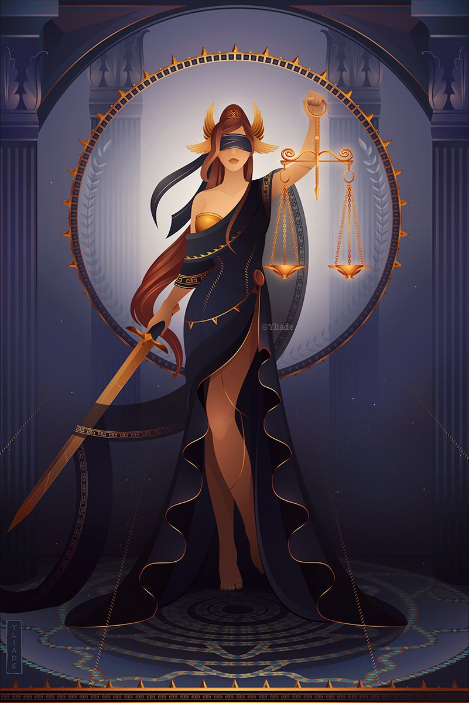

# Project-Themis
Project Themis is a discord bot named after of the greek goddess of justice, divine order, fairness and law. It's an attempt to ensure fair team distribution in Age of empires 2. The user use '!teams' in discord text channel and the bot divide all players participating in user's game based on their levels to two different voice channels.

